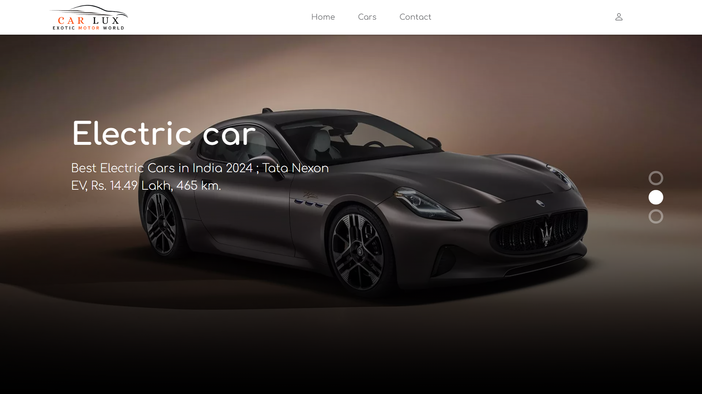

# CarLux 🚗✨

**The Ultimate Car Booking & Management System**


## 🚀 Overview

CarLux is a modern, feature-rich car booking platform designed for both users and administrators. Whether you want to book the latest electric or fuel cars, manage bookings, or oversee a fleet, CarLux makes it seamless, secure, and stylish.


## 🌟 Features

### For Users
- **Browse & Book Cars:** Explore a curated selection of electric and fuel cars with detailed specs and images.
- **User Profiles:** Manage your bookings, reviews, and personal information.
- **Secure Authentication:** Sign up, sign in, OTP verification, and password reset flows.
- **Reviews & Ratings:** Share your experience and read others' feedback.
- **Responsive UI:** Enjoy a beautiful, mobile-friendly interface powered by Bootstrap.

### For Admins
- **Admin Dashboard:** Get insights on users, bookings, and car inventory at a glance.
- **Car Management:** Add, update, or remove electric and fuel cars, including images and details.
- **Booking Oversight:** Approve, reject, or review all bookings.
- **Reports:** Generate date-wise, car-wise, and customer-wise booking reports.
- **Brand Management:** Add and manage car brands easily.


## 🖼️ Screenshots

### Home Page


### Show More
>[More Screenshots...](https://github.com/SonaniAkshit/Car-Booking-System-PHP/tree/main/carlux/screenshots/README.md)


## 🛠️ Tech Stack

- **Frontend:** HTML5, CSS3, Bootstrap, JavaScript, Slick Carousel
- **Backend:** PHP (Procedural)
- **Database:** MySQL
- **Authentication:** Session-based, OTP verification
- **Admin Panel:** Custom PHP dashboard


## ⚡ Quick Start

1. **Clone the repository:**
   ```bash
   git clone https://github.com/SonaniAkshit/Car-Booking-System-PHP.git
   ```
2. **Import the database:**
   - Find the SQL file in `/carlux/databse/` and import it into your MySQL server.
3. **Configure database connection:**
   - Edit `carlux/config.php` and `carlux/admin/config.php` with your DB credentials.
4. **Run locally:**
   - Place the project in your web server's root (e.g., `htdocs` for XAMPP).
   - Visit `http://localhost/carlux/` in your browser.


## 👤 User Roles

- **User:** Can browse, book, and review cars.
- **Admin:** Full access to manage cars, bookings, users, and reports.


## 📂 Project Structure

```
carlux/
  ├── admin/         # Admin panel files
  ├── css/           # Stylesheets
  ├── images/        # Images and icons
  ├── js/            # JavaScript files
  ├── screenshots/   # Project Screenshots
  ├── databse/       # Database files (SQL)
  ├── *.php          # Main application files
```


## 🙌 Contributing
- Pull requests and feedback are welcome! Whether it's fixing bugs, improving UI, or adding features — your help is appreciated.

## 📧 Contact
- **Developer:** Akshit Sonani
- **Email:** sonaniakshit684@gmail.com
- **GitHub:** [SonaniAkshit](https://github.com/SonaniAkshit)

# 🔥 Happy Coding! 🚀
### ⭐ Star this repository if you find it helpful!
